# Statova Nadejda — IA2404

**Уровень:** продвинутый  
**Вариант деплоя:** A

**Репозиторий:** https://github.com/nstatova-cloud/timecapsule

## Скриншоты базового уровня

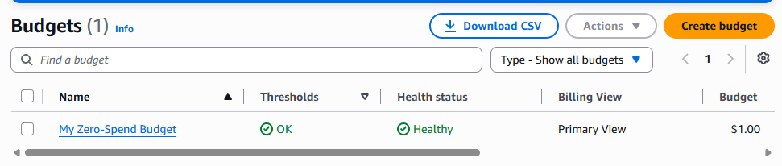
*Задание 1: бюджет ZeroSpend в списке Budgets*

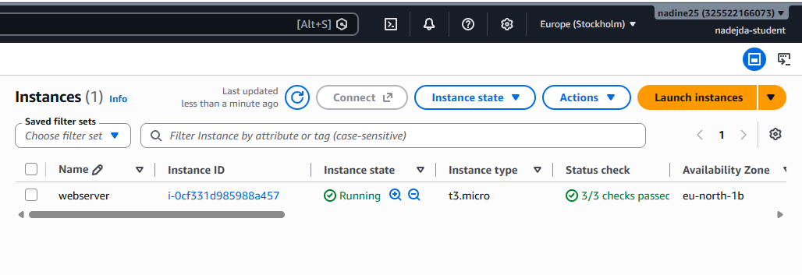
*Задание 2: экземпляр webserver в состоянии Running с пройденными проверками*

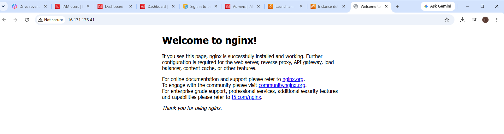
*Задание 2: страница nginx в браузере по публичному IP*

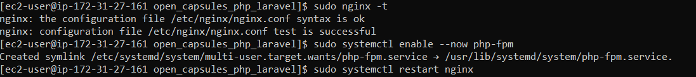
*Задание 3: вкладка Monitoring и фрагмент System log с установкой nginx*

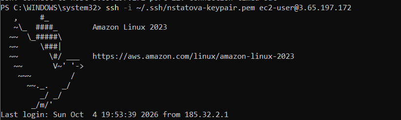
*Задание 4: успешное подключение по SSH и вывод systemctl status nginx*

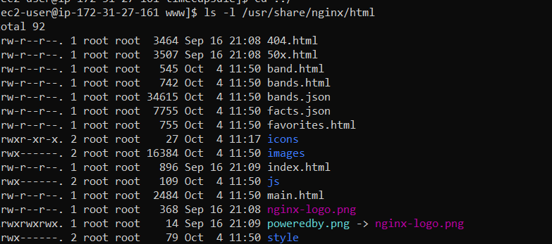
*Задание 5: ваш сайт в браузере и вывод ls -l /usr/share/nginx/html*

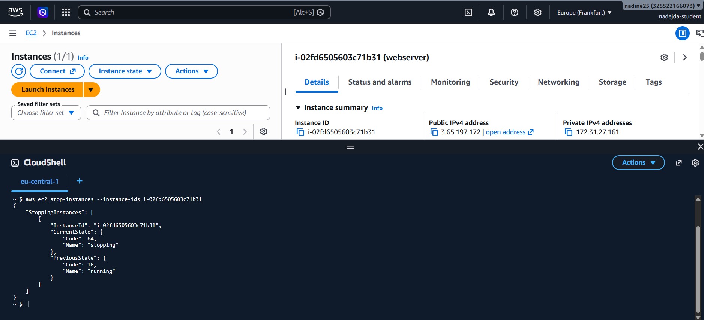
*Задание 6: команда aws ec2 stop-instances и её вывод*

## Скриншоты продвинутого уровня

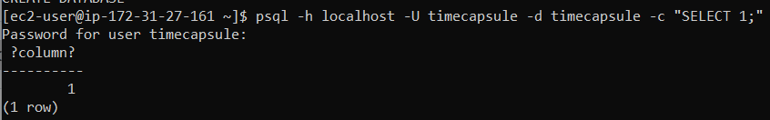
*Задание 9: вывод psql ... -c "SELECT 1;"*

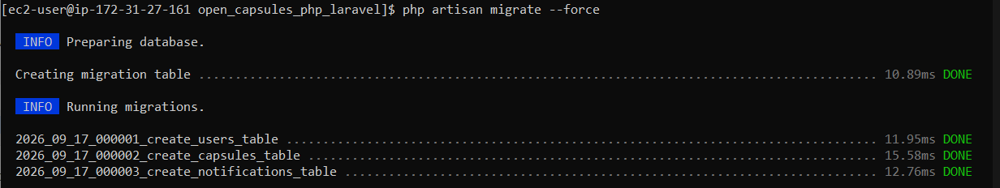
*Задание 10: вывод php bin/init-db.php*

*Задание 11: вывод sudo nginx -t*

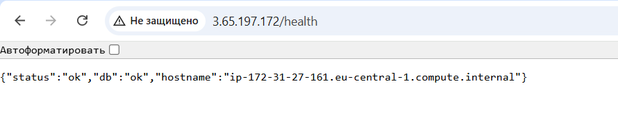
*Задание 11: ответ /health*

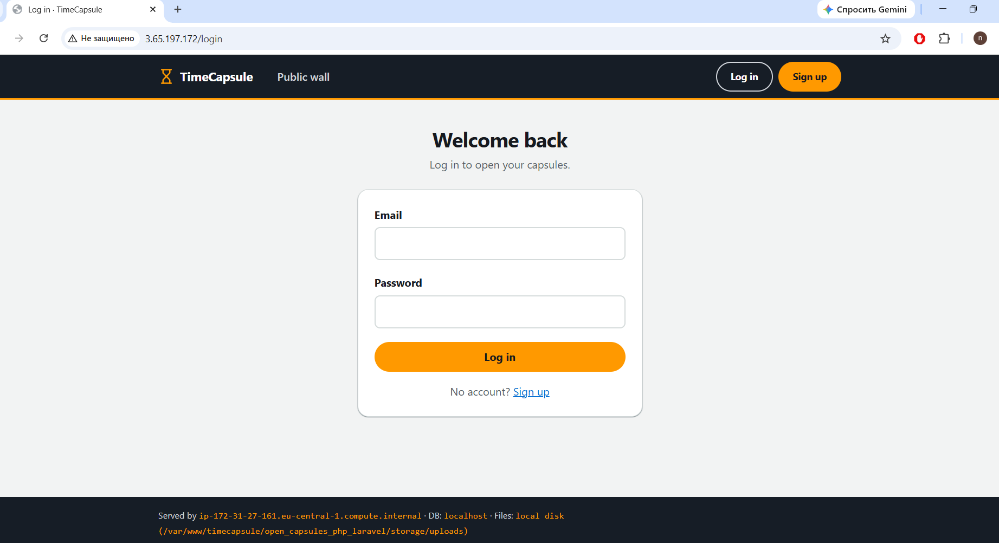
*Задание 11: приложение в браузере*

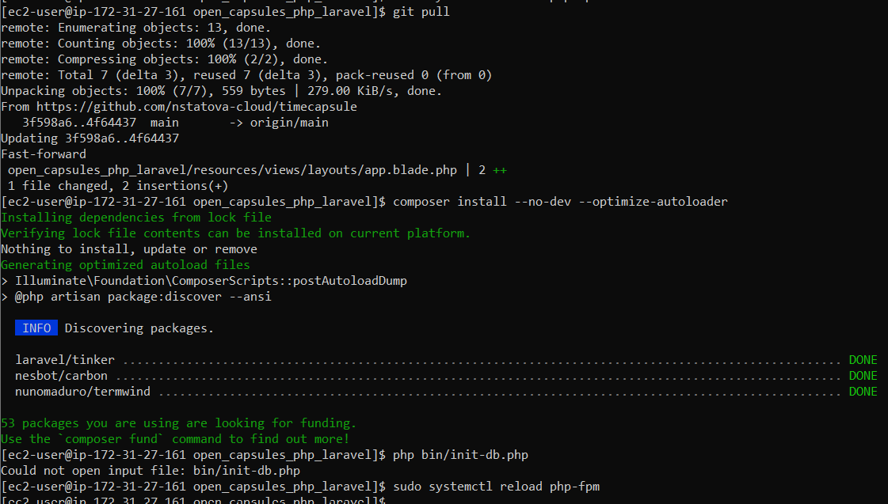
*Ручной деплой*

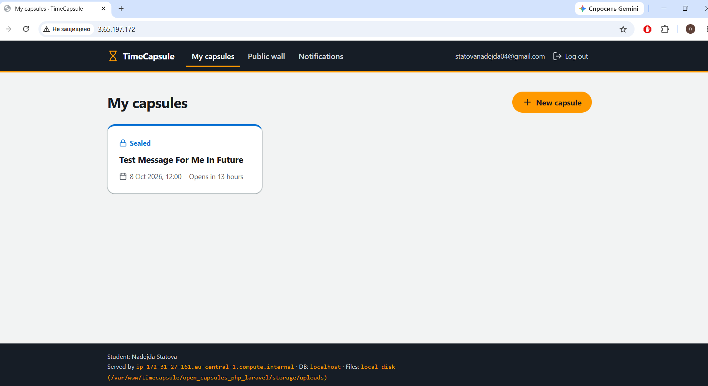
*Задание 13: новая версия с вашим изменением на странице*

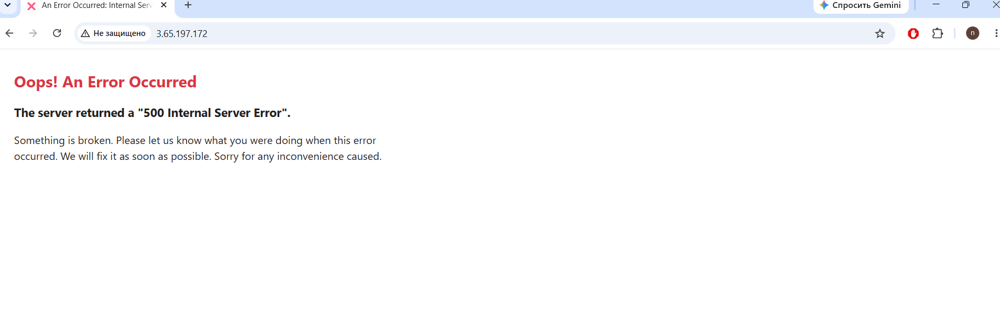
*Задание 13: ошибка 500 после сломанного деплоя и работающий сайт после git revert и повторного деплоя*

## Ответы на вопросы

### Базовый и продвинутый уровни

### 1. Что разрешает политика AdministratorAccess? Почему для повседневной работы нельзя использовать root?
   AdministratorAccess даёт почти полный доступ ко всем сервисам AWS.

   root лучше не использовать каждый день, потому что у него вообще максимальные права. Если аккаунт root взломают или случайно сделать неправильное действие, можно потерять ресурсы или настройки. Поэтому обычно работают через IAM-пользователя.
### 2. Что такое User data и когда выполняется этот скрипт? Выполнится ли он повторно после перезагрузки экземпляра?
   User data — это скрипт, который EC2 выполняет автоматически при первом запуске экземпляра.

   В этом задании он устанавливает htop, nginx и запускает nginx.

Обычно после обычной перезагрузки этот скрипт повторно не выполняется.
### 3. Какая проверка укажет на проблему, которую можете исправить вы, а какая — на проблему на стороне AWS?
   - Instance status check — проблема внутри вашей виртуальной машины. Обычно это можете исправлять вы.

   - System status check — проблема с инфраструктурой AWS. Это проблема на стороне AWS.

   - Attached EBS status check — проблема с подключённым диском EBS.
### 4. В каких случаях стоит включать Detailed monitoring?
   Когда нужно чаще получать данные о сервере.

Обычный мониторинг обновляется примерно раз в 5 минут, а Detailed monitoring — раз в минуту.

Например, его стоит включить для важного сервера, где нужно быстро заметить высокую нагрузку или проблему.
### 5. Почему для входа на экземпляр EC2 используется ключ, а не пароль?
   Потому что SSH-ключ безопаснее обычного пароля.

Пароль можно подобрать или украсть. Приватный ключ находится только у владельца и его намного сложнее подобрать.
### 6. Что делает команда scp и чем она похожа на ssh?
   scp копирует файлы между вашим компьютером и сервером.

Например:
`scp file.html ec2-user@IP:~`
ssh подключает вас к командной строке сервера.

Они похожи тем, что оба используют защищённое SSH-соединение и SSH-ключ.
### 7. Чем Stop отличается от Terminate? За что вы продолжаете платить, пока экземпляр остановлен?
   Stop — сервер временно выключается. Его потом можно снова запустить.

Terminate — экземпляр удаляется.

Когда EC2 остановлен, за работу самого виртуального сервера обычно платить не нужно, но могут оставаться расходы за диск EBS и другие связанные ресурсы.
### 8. Почему папка vendor/ и файл .env не попали в репозиторий?
   Потому что они указаны в .gitignore.

vendor/ можно заново создать командой:
`composer install`
.env не отправляют в Git, потому что там находятся секретные настройки, например пароль от базы данных.
### 9. Почему мы устанавливаем эти пакеты вручную, а не добавляем их в User data?
   Потому что User data обычно используется для первоначальной настройки сервера.

А эти пакеты нужны уже для конкретного приложения. Их удобнее устанавливать вручную, чтобы видеть процесс и ошибки.
### 10. Почему пароль к базе данных хранится в .env на сервере, а не в коде в репозитории?
    Потому что пароль — это секрет.

Если записать его прямо в код и отправить на GitHub, его смогут увидеть другие люди.

В .env пароль хранится только на сервере, а сам .env находится в .gitignore.
### 11. Почему публичный репозиторий безопасен для этого приложения?
    Потому что в публичном репозитории хранится только код.

Пароли и другие секреты находятся в .env, который не отправляется в GitHub.

То есть люди могут видеть код, но не получают пароль от базы данных.
### 12. Что может увидеть посетитель, если откроет сайт во время git pull?
    Во время git pull файлы обновляются не одновременно.

Поэтому несколько секунд посетитель может увидеть:

- старую версию;

- новую версию;

- смешанную версию;

- ошибку 500.
### 13. Что случится с сайтом, если после git pull не выполнится composer install?
    Если новая версия приложения требует новых библиотек, они не будут установлены.

Из-за этого приложение может перестать работать и показать ошибку 500.
### 14. Почему /health отвечает ok, хотя главная страница не работает?
    Потому что /health проверяет не всю страницу сайта.

Он обычно проверяет только основные вещи, например:

- приложение запускается;

- база данных доступна.

Ошибка в views/layout.php может ломать главную страницу, но /health этот файл вообще не использует.
### 15. Что на самом деле проверяет адрес /health?
    Он проверяет состояние приложения и соединение с базой данных.

Например ответ:
`{"status":"ok","db":"ok"}`
означает, что приложение отвечает и база доступна.
### 16. Чего не хватает такой проверке /health?
    Она не проверяет, что реальные страницы сайта работают правильно.

То есть /health может писать ok, хотя главная страница показывает 500.

Для более полной проверки нужно дополнительно открывать настоящие страницы приложения.
### 17. Сколько времени сайт был сломан? Из каких шагов сложилось это время?
    Сайт был сломан от момента плохого деплоя до момента успешного отката.

Это время состоит из:

- времени, чтобы заметить ошибку;

- времени, чтобы понять причину;

- git revert;

- git push;

- нового деплоя;

- перезапуска или reload приложения.
### 18. Как можно было бы сократить время простоя сайта?
    Можно автоматизировать процесс.

Например:

- автоматически тестировать код до деплоя;

- использовать CI/CD;

- автоматически проверять /health;

- быстро делать rollback;

- не заменять рабочую версию до тех пор, пока новая не проверена.

### Дополнительные вопросы продвинутого уровня

### 1. Как проходит запрос от браузера до базы данных? Какую роль играет каждая программа?
Когда пользователь открывает сайт:

- браузер отправляет запрос на сервер;

- nginx принимает этот запрос;

- если нужен обычный файл, например картинка или CSS, nginx отдаёт его сам;

- если нужно выполнить PHP-код, nginx передаёт запрос в PHP-FPM;

- PHP-код при необходимости обращается в PostgreSQL;

- PostgreSQL возвращает данные;

- PHP формирует готовую страницу;

- nginx отправляет эту страницу обратно в браузер.

Коротко:

Браузер → nginx → PHP-FPM → PostgreSQL → PHP-FPM → nginx → браузер.

Роли:

- nginx — принимает запросы;

- PHP-FPM — выполняет PHP-код;

- PostgreSQL — хранит данные;

- браузер — показывает результат пользователю.
### 2. Почему сервер может скачивать код из репозитория, но не может отправлять в него изменения? Почему для сервера это правильно?
Репозиторий публичный, поэтому сервер может его читать и скачивать код через:
`git pull`
Но чтобы отправлять изменения через:
`git push`
нужно войти в GitHub и иметь права на запись.

На сервере таких прав нет.

Это правильно, потому что сервер должен только получать готовый код, а не менять его.

Если сервер взломают, злоумышленник не сможет через него изменить код в GitHub.

Коротко:

Сервер может читать код, но не может его менять. Это безопаснее.
### 3. Что произойдёт с загруженными пользователями файлами, если удалить экземпляр EC2? Как это связано с EBS?
В нашей работе файлы пользователей хранятся прямо на диске сервера.

Если просто сделать:
`Stop`
файлы обычно останутся, потому что диск EBS остаётся.

Но если сделать:
`Terminate`
экземпляр удаляется.

И если его основной EBS-диск тоже настроен на удаление, то файлы пользователей тоже пропадут.

То есть:

Stop — сервер выключен, но данные обычно остаются.

Terminate — сервер удаляется, и его диск тоже может быть удалён.

EBS — это диск, где хранятся файлы сервера.

Поэтому важные пользовательские файлы лучше хранить отдельно или делать резервные копии.
### 4. Что общего у последовательности команд варианта A с тем, что делают системы CI/CD? Чего в этом процессе ещё не хватает?
В варианте A деплой выполнялся вручную, команда за командой.

Например:
`git pull``composer install --no-dev --optimize-autoloader``php artisan migrate --force``php artisan config:cache``sudo systemctl reload php-fpm`
Это похоже на CI/CD, потому что выполняются те же основные шаги:

- скачивается новый код;

- устанавливаются зависимости;

- обновляется база данных;

- применяются настройки;

- перезапускается приложение.

Разница в том, что здесь все команды запускались вручную.

В CI/CD этот процесс обычно запускается автоматически, например после git push.

Чего не хватает:

- автоматического запуска;

- автоматических тестов;

- автоматической проверки, что сайт работает после деплоя;

- автоматического отката, если новая версия сломалась.

## Задание 14  
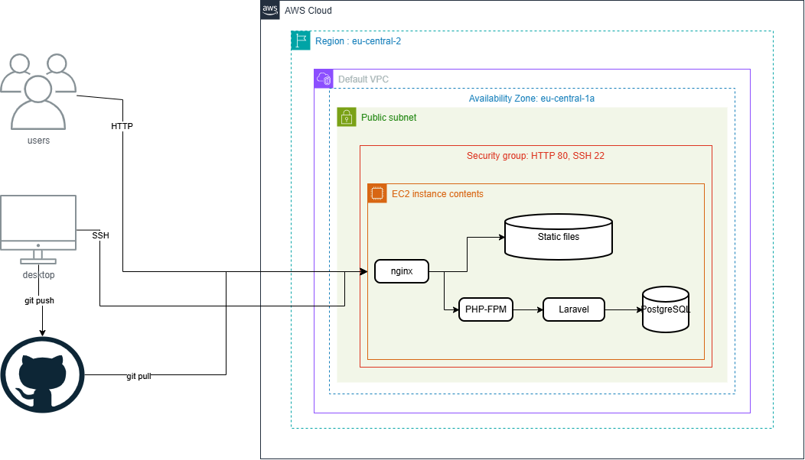
*Схема развертывания*

Ссылка на ADR файл: https://github.com/nstatova-cloud/timecapsule/docs/adr/0001-deploy-method.md

